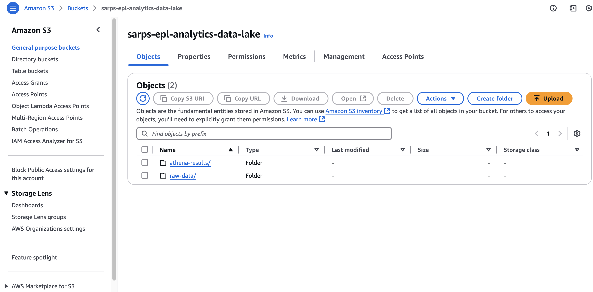
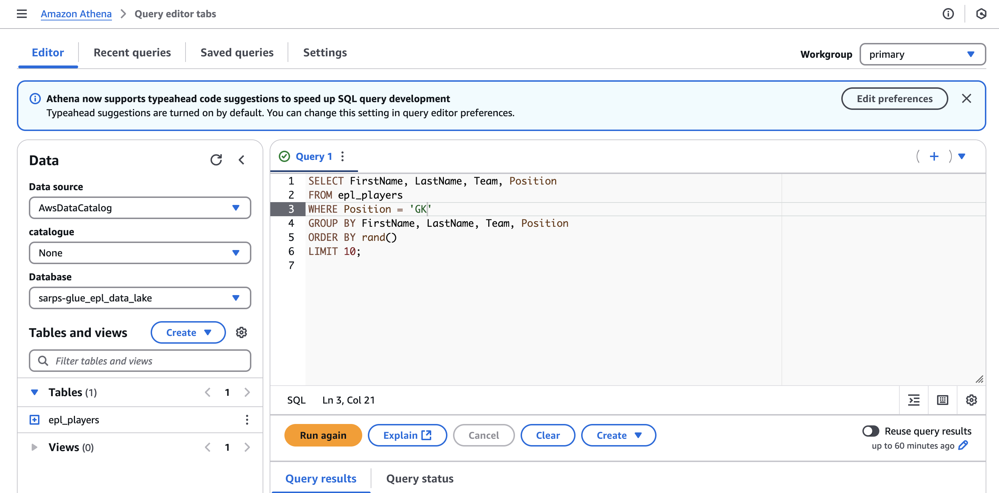

# EPL Data Lake Project

## Overview
This project automates the creation of a **data lake** for **English Premier League (EPL) player analytics** using **AWS services**. It fetches player data from **SportsData.io**, stores it in **Amazon S3**, creates a **Glue database and table**, and enables querying through **Amazon Athena**.

## Features
- **Automated Data Ingestion**: Fetches player data for all EPL teams from SportsData.io.
- **S3 Storage**: Stores EPL player data in Amazon S3 in JSON Lines format.
- **AWS Glue Integration**: Creates a Glue database and table for structured querying.
- **Athena Query Support**: Enables SQL queries on player data.
- **Error Handling**: Skips teams that cause API errors and logs failed requests.

## Tech Stack
- **Python** (boto3, requests, dotenv)
- **AWS Services**:
  - **Amazon S3** (Storage for raw data)
  - **AWS Glue** (Schema definition)
  - **Amazon Athena** (Querying data)
- **SportsData.io API** (Source of EPL player data)

## Setup Instructions
### 1. Prerequisites
- AWS account with permissions for **S3, Glue, and Athena**.
- SportsData.io API key.
- Python installed with `boto3`, `requests`, and `python-dotenv`.

### 2. Clone the Repository
```sh
 git clone https://github.com/yourusername/epl-data-lake.git
 cd epl-data-lake
```

### 3. Set Up Environment Variables
Create a `.env` file in the project root with:
```ini
SPORTS_DATA_API_KEY=your_sportsdata_api_key
EPL_ENDPOINT=https://api.sportsdata.io/v4/soccer/scores/json/Teams/EPL
```

### 4. Run the Data Lake Setup Script
```sh
python3 src/setup_epl_data_lake.py
```

This will:
- Create an S3 bucket (`sarps-epl-analytics-data-lake`)
- Create an AWS Glue database (`sarps-glue-epl-data-lake`)
- Fetch EPL player data from SportsData.io
- Store the data in S3 in JSONL format
- Create a Glue table (`epl_players`)
- Configure Athena for querying

## Screenshots
### **Amazon S3 Bucket**


### **Objects in the S3 Bucket**


### **Raw Data Stored in S3**


## Querying Data in AWS Athena
Once the setup is complete, go to **AWS Athena** and run SQL queries on the `epl_players` table.

### Example Queries
#### **Get 10 Random Attackers**
```sql
SELECT FirstName, LastName, Team, Position 
FROM epl_players 
WHERE Position = 'A'
GROUP BY FirstName, LastName, Team, Position
ORDER BY rand()
LIMIT 10;
```


#### **Get 10 Random Goalkeepers**
```sql
SELECT FirstName, LastName, Team, Position 
FROM epl_players 
WHERE Position = 'GK'
GROUP BY FirstName, LastName, Team, Position
ORDER BY rand()
LIMIT 10;
```



#### **Get 10 Brazilian Players**
```sql
SELECT FirstName, LastName, Team, Position, Nationality 
FROM epl_players 
WHERE Nationality  = 'brazil'
GROUP BY FirstName, LastName, Team, Position, Nationality 
ORDER BY rand()
LIMIT 10;
```


## Cleanup
To delete all AWS resources created:
```sh
python3 src/delete_aws_resources.py
```
This will remove:
- The S3 bucket and all stored data.
- The Glue database and table.
- Athena query results.

## Future Improvements
- **Automate Data Updates**: Schedule daily updates using AWS Lambda.
- **Use Parquet Format**: Reduce query costs by converting data to Parquet.
- **Data Visualization**: Connect Athena to QuickSight or Tableau for analysis.


---
Contributions and feedback are welcome! 🚀

